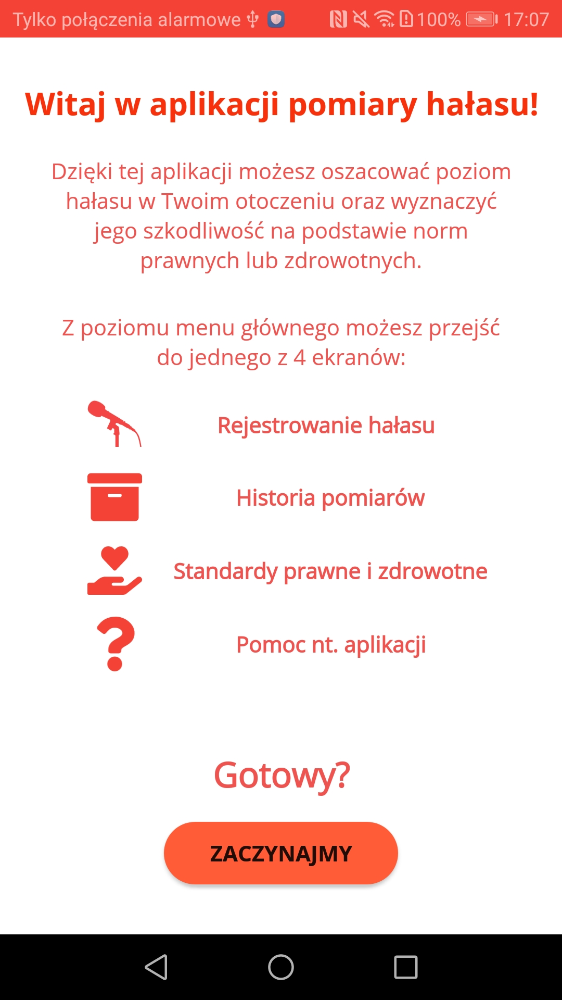
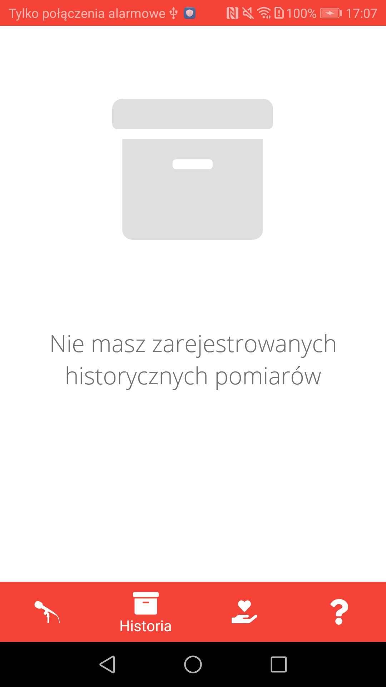
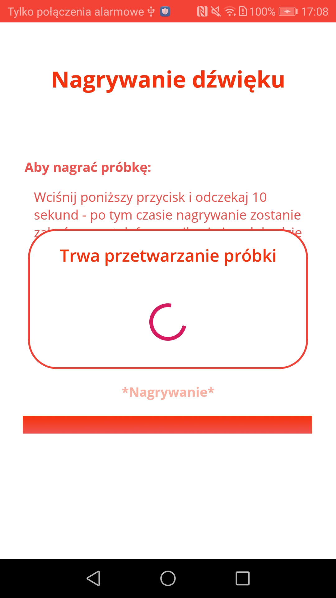
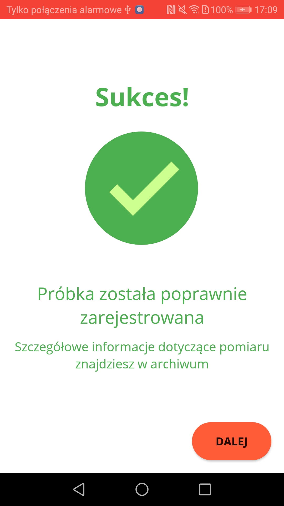
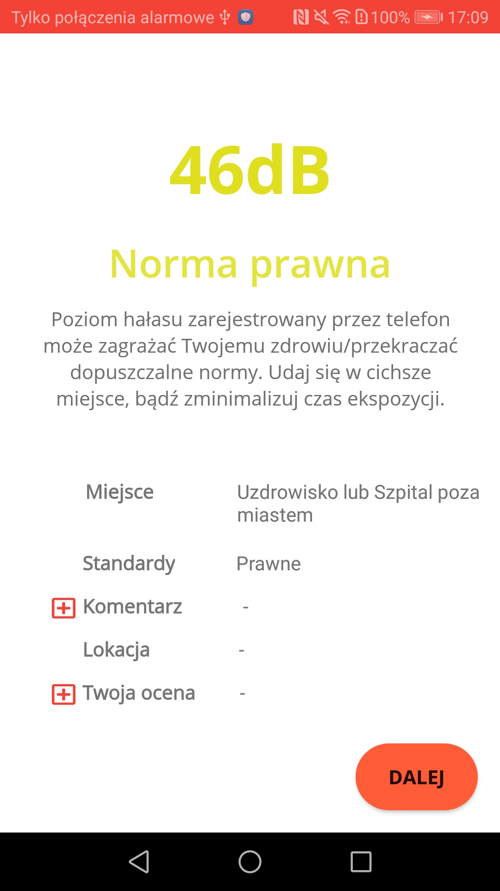
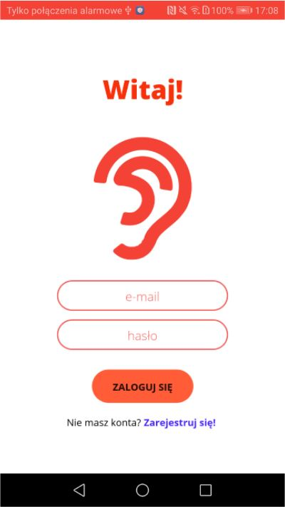

# Noise Measurement Mobile Application

Mobile application created as a part of project that allows noise measurements. There is also server-sided part of this project [(Noise Measurements Server Application)](https://github.com/DamiCoder/noisemeasurementserver).

Mobile application is used to: 
* Register sound records, which are processed further on remote server
* Display information about diseases caused by noise exposure
* Register new users, who can see their private data about historical measurements 

Application has been created for Android system and is fully written in Kotlin language.

You can see below some in-app screenshots, where created solution is shown:

| | | |
|:-------------------------:|:-------------------------:|:-------------------------:|
|  |  | |
| |   | |